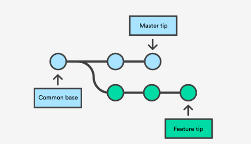
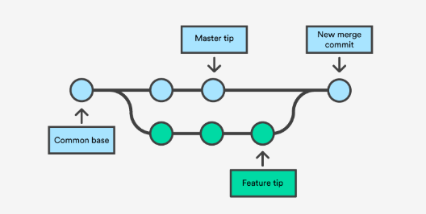

## Prelude: Installing Git<a href="#note1" id="note1ref">1</a>

Open Terminal and enter `git --version` to see if you have Git installed. A message like `git version 2.20.1 (Apple Git-117)` indicates that you are ready to use Git. If you don't have Git installed, then an alert will appear displaying `The "git" command requires the command line developer tools. Would you like to install the tools now?`

There are three options:

1. Click Install and get the Command Line Developer Tools. This hassle-free experience will give you the Apple version of Git. 

2. Install Xcode, which includes the Command Line Developer Tools. 

3. Click Cancel and get the latest version of Git [directly from the developers](https://git-scm.com/downloads).

If you already have Git installed, you can follow [these instructions](https://www.michaelcrump.net/step-by-step-how-to-update-git/) to update to the latest version. 

## Git on your Local Machine

1. Creating a New Git Repository Using `git init`

> *Exercise: create a new directory named `GitTutorial` and navigate inside it.*

Once your present working directory is `GitTutorial/`, simply type `git init` to begin using Git for version control. 

> *Exercise: type `git init`*

Terminal will output  `Initialized empty Git repository in /path/GitTutorial/.git/` where `path` specifies the location of `GitTutorial/`.  This empty Git repository is hidden; note the differnces of `ls` and `ls -a` in `GitTutorial/`<a href="#note2" id="note2ref">2</a>.

2. Saving Using `git add` and `git commit`

The command `git add .` tells Git to take a snapshot of the current status of the directory<a href="#note3" id="note3ref">3</a>.

> *Exercise: type `git add .`*

This snapshot is now stored in a temporary staging area which Git calls the *index* and this process is called *staging*. You can permanently store staged files with `git commit`. One of the benefits to using Git is that you can tag each commit with a *message*<a href="#note4" id="note4ref">4</a>. This should be something short and informative, e.g. "initial commit" or "adding June data". `git commit` on its own will prompt you to provide a message; alternatively, you can use `git commit -m "message"`

> *Excercise: Commit your current directory to your local machine.*

3. Making Changes to Your Git Repository

Suppose you add new files/directories or make changes to existing files in your Git repository. These changes are not automically stored by Git; you must tell Git precisely what you want to add every time you want to make a commit. Git is very flexible in what it allows you to commit: you can choose to commit a single modified file, everything that has been modified, or anywhere in between. 

+ `git add file` stages `file` only. 
+ `git add file1 file2` stages `file1` and `file2`; this is extendable to any number of files. Alternatively, you could use `git add file1` and `git add file2` as separate commands.
+ `git add -A` stages changes from ALL tracked and untracked files. 
+ `git add .` stages new and modified files but not deleted files
+ `git add -u` stages modified and deleted files but not new files
+ `git commit -a` is equivalent to `git add -u` and `git commit -m "message"`

Remember that with the exception of the last command, you must commit your files before Git permanently saves the changes!

> *Exercise: Create and modify some dummy files and play around with various `git add` and `git commit` commands to make changes to your repository.*

4. Branches: Creating Diverging Workflows with `git branch` and `git switch`

One of the most useful features of Git is its ability to create *branches*, new lines of development that can build on existing work without messing anything up <a href="#note5" id="note5ref">5</a>. For example, you might want to experiment in a sandbox environment before making a (more) permanant change to your repository, or you may want to create a separate workflow line for your personal contributions to a group project. Changes on one branch do not automatically show up on another branch. 

The command `git branch branch_name` creates a branch called `branch_name`. `git branch` without specifying `branch_name` will list existing branches. The primary/original branch is named `master` and the branch you are currently on is marked with an asterisk (`*`). The command `git switch branch_name` switches your repository to `branch_name` as long as a branch with that name exists. 

> *Exercise: type `git branch`. Then create a new branch called `feature`, use `git switch` to switch to `feature`, and type `git branch` again.*

> *Exercise: create a new file or modifiy an existing file and commit it on the `feature` branch. Switch back to `master` to verify that these changes are isolated to the `feature` branch.*

5. Integrating Separate Workflows with `git merge`<a href="#note6" id="note6ref">6</a>

> *Exercise: make and commit a different change to the `master` branch*

At this point the two branches have diverged, with different changes made in each. Visually, the repository looks something like this: 

The command `git merge branch` *merges* the changes made on `branch` to your current branch, typically `master`. It is recommended that you confirm the receiving branch with `git branch` before merging!

> *Exercise: merge `feature` to `master`*

In this simple scenario, merging should not have caused any issues, and the following image illustrates the new status of your repository <a href="#note7" id="note7ref">7</a>: 

*Merge conflicts*, however, can prevent Git from merging two branches automatically. This can happen for a number of reasons, for example both branches have different changes made to the same line(s) of a particular file or one branch has made changes to a file that the other branch has deleted <a href="#note8" id="note8ref">8</a>.

At this point, you could delete the `feature` branch with `git branch -d feature`. This command ensures that the changes in the `feature` branch are already in the current branch. Conversely, if you develop on a branch `crazy-idea`, but then regret it and want to delete all of the changes made on this branch, you can delete it with `git branch -D crazy-idea`. 

6. It is Easy to Git <a href="#note9" id="note9ref">9</a> Lost: Fixing Confusion with `git status` and `git diff`

If you have made a lot of changes to your repository or simply can't remember what you have staged, the the command `git status` can help to reorient yourself. According to the [documentation](https://git-scm.com/docs/git-status),`git status` displays paths that have differences between the index file and the current HEAD commit, paths that have differences between the working tree and the index file, and paths in the working tree that are not tracked by Git. The first are what you would commit by running `git commit`; the second and third are what you could commit by running `git add` before running `git commit`. `git status` also reminds you on what branch you are currently working. 

It is also worth mentioning that `git diff` can be used to show the changes made to modified files. 

*Excercise: Continue playing around with `git add`, `git reset`, and `git commit` on dummy files, but this time also use `git diff` and `git status` to see how different actions change your repository.*

7. Exploring History: `git log`, `git checkout`, and `git reflog`

The command `git log` displays the history of your commits, with more recent commits at the top. Use the `arrow` keys to scroll and press `q` to exit. 

> *Exercise: Type `git log`*

Observe that each commit lists the author, date, branch and commit message, as well as the associated 40-character checksum hash. This hash is one of the most powerful features of Git, as it enables you to switch to a different state of the repository. The command `git checkout hash`, where `hash` is the beginning (first 5-15 characters) of a particular commit, will change the contents of your repository from its current status to what it contained at that commit. This is best used when you merely want to look at the contents from this commit; see below if you want to make changes from this commit. 

At this point, it is worthwhile to define `HEAD`, a term which you may have already noticed. `HEAD` is simply a reference to the current (most recent) commit on the current branch. If you are not on the latest commit - meaning that `HEAD` is pointing to a prior commit in history - then it's called `detached HEAD`.

> *Exercise: use `git checkout` to switch your repository to a previous commit.*

The command `git reflog` displays the history of changes which updated `HEAD`.  

> *Exercise: type `git reflog`*

In addition to `git checkout`, there are a few more ways to move around your repository's commit history:

+ `git checkout HEAD@{...}` will move `HEAD` to the commit {...} as described by `git reflog`
+ `git checkout -` switches `HEAD` to its position before the previous `checkout`<a href="#note10" id="note10ref">10</a> 
+ `git checkout branchname` returns to the commit that is the head of `branchname`

> *Exercise: Move around your commit history using `git log`, `git reflog`, and `git checkout`*

8. Creating Branching Timelines

Now suppose that instead of merely viewing the contents of a past commit, you want to use that commit to begin a new branch. Git allows (at least) two ways to do this:

+ `git checkout` to move to the desired commit followed by `git switch -c <new-branch-name>`
+ `git checkout -b <new branch> <commit_id>` (this essentially combines the two distinct steps of the previous method into one)

> *Exercise: Create a branch from `master` at a past commit and commit some changes on this branch. Attempt to merge this branch with the most recent commit on `master`.* 

9. Undoing Commits and Changes: `git reset` and `git revert`

Suppose you staged the wrong file to commit, or you staged the correct one prematurely. `git reset file` will remove `file` from the index. `git reset` on its own will unstage all due changes. 

Alternatively, suppose that you not only staged the wrong file(s), but you also commited the changes. `git revert HEAD` tells Git to create a new commit which is an inverse of the previous commit: anything deleted in the most recent commit will be added, and anything added in the most recent commit will be deleted. This is ideal for published changes because it preserves the true history of the repository. `git revert` can also be used to undo multiple commits, using either `git <hash-or-ref>` to revert to a specific commit or `git revert HEAD~N` where `N` is the number of commits you wish to revert (e.g. `git revert HEAD~2` reverts two commits).

`git revert` does not delete the undesired commits; if this is your intention, `use git reset --hard <hash-or-ref>` The `--hard` option reverts everything back to the specified commit, including reference pointers, the staging index, and your working directory. Thus not only does this command revert to a previous commit, it also deletes all working changes. To avoid losing any working changes, you can use `stash` to save your working changes before reseting and `stash pop` to recover the changes after reseting. 

`git reset` also has a `--soft` option that works only affects the commit history, not your working directory or staging index. This is likely the best option if you have uncommited changes that you want to keep. 

> *Exercise: play around with `git reset` and `git revert` to undo changes made to your repository.*

10. Move, Copy, Rename, and Delete: `git mv`, `git cp`, and `git rm`

Git has built-in commands to move, rename, copy, and delete files. `git mv`, `git cp`, and `git rm` perform analagously to `mv`, `cp`, and `rm`. The benefit of using these Git commands is that they automatically add the file to the index so that you only have to commit the changes. 

> *Exercise: play around with `git mv`, `git cp`, and `git rm`*

11. Fully Deleting a Git Repository

Finally, suppose that after a series of commits, branches, and merges, everything is up-to-date on and accurate on `master` and you want to start fresh with a new Git repository. The command `rm -rf .git` deletes the `.git/` repository and leaves only the working diretory. `git init` can be used on this clean directory to start a new workflow. As with any use of `rm`, use with caution!

## Aditional Resources

If you want Git help directly in the terminal, type `man gittutorial` or `man giteveryday`.

If you made a mistake and are unsure how to fix it, check out [Oh Shit, Git!?](https://ohshitgit.com/)

For a textbook writen by the authors of Git, see [Pro Git](https://git-scm.com/book/en/v2).

<a id="note1" href="#note1ref">1</a> For more information, visit [Macworld](https://www.macworld.co.uk/how-to/mac-software/how-use-git-github-on-your-mac-3639136/).

<a id="note2" href="#note2ref">2</a> Recall that hidden files/directories should not be modified unless you know what you are doing - the Git repository is hidden for a reason!

<a id="note3" href="#note3ref">3</a> Recall that `.` refers to your current directory.

<a id="note4" href="#note4ref">4</a> [A note on commit messages](https://git-scm.com/docs/gittutorial): Though not required, it’s a good idea to begin the commit message with a single short (less than 50 character) line summarizing the change, followed by a blank line and then a more thorough description. The text up to the first blank line in a commit message is treated as the commit title, and that title is used throughout Git.

<a id="note5" href="#note5ref">5</a> There is a lot that goes on beyond the scenes that makes Git's handling of branches much more efficient than other version control methods.

<a id="note6" href="#note6ref">6</a> Images courtesy of [Atlassian](https://www.atlassian.com/git/tutorials/using-branches/git-merge)

<a id="note7" href="#note7ref">7</a> The command `gitk` shows a graphical representation of your specific history.

<a id="note8" href="#note8ref">8</a> For more information on handling merge conflicts, visit [this tutorial](https://www.atlassian.com/git/tutorials/using-branches/merge-conflicts).

<a id="note9" href="#note9ref">9</a> Pun intended.

<a id="note10" href="#note10ref">10</a> Note the similarity to `cd -`.