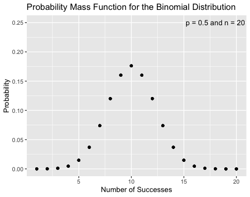

## Bernoulli Distribution

Coin flipping - throwing a coin into the air and checking whether heads or tails is displayed when it lands - is one of the most elementary science experiments. Even children understand that the two potential outcomes are random. In statistics, modeling this binary (i.e. yes/no) outcome is done with a *Bernoulli distribution*. The [Bernoulli distribution](https://en.wikipedia.org/wiki/Bernoulli_distribution) is a discrete probability distribution, meaning it can only take distinct values. Specifically, we may assign "heads" to the number "1" and "tails" to the number "0". (Nothing is preventing us from choosing the opposite assignment.) Often, statisticians choose to use "1" to represent "yes" or "success". 

Formally, the Bernoulli distribution describes a random variable that takes the value 1 with probability *p* and the value *0* with the probability *q = 1 - p*. In the coin tossing example (assuming a "fair" coin), *p = q = 1/2*. 

## Binomial Distribution

You may be asking yourself: so what? It is obvious that a coin flip can yield heads or tails with equal probability. Is this formalization necessary?

The benefit to approaching coin flipping (and any other binary outcome) in the lens of a Bernoulli distribution is that the Bernoulli distribtuion is a special example of the *binomial distribution*. The [binomial distribution](https://en.wikipedia.org/wiki/Binomial_distribution) describes the probability of obtaining *k* successes out of *n* Bernoulli trials when the probability of success is *p*, assuming each trial is *independent* (i.e. the outcome of one trial does not influence the outcome of the next trial). This probability can be calculated using the probability mass function (PMF) of the binomial distribution:

for *k = 0, 1, 2, ..., n,* where

is the *binomial coefficient* (hence why the distribution is called the binomial distribution). This is much more interesting than simply asking what the probability of success and failure of the next trial is!

Though the PMF can seem complicated at first, the interpretation is relatively straightforward when it is broken into its constituent parts. First,  represents the probability of succeeding *k* times when each success has probability *p*. If there are *k* successes in *n* trials, then there are *n - k* failures. Therefore,  is the probability of failing *n - k* times. Since each trial is independent, we can simply multiply these two probabilities together. Finally, the binomial coefficient at the beginning of the formula captures the fact that there are (almost always) many different ways to obtain *k* successes; for instance, they may all be at the beginning, all at the end, or anywhere in between.

Below is a graph of the binomial distribution's PMF of a fair coin for *n = 20* trials. 

Unsurpisingly, the PMF is maximized when *n = 10*: When the probability of success is equal to the probability of failure, the most likely result is an equal number of successes and failures. The beauty of the binomial distribution is that it allows us to figure out what the most likely outcome is when the outcome of the experiment is biased toward either success or failure. Indeed, the mean of a binomial distrubtion is always given by the product *np*.  Moving away from the peak, the PMF decays symetrically; this is expected due to the fact that 

Check out my [Shiny app](https://larnold1997.shinyapps.io/binomialpmf/) to see how the binomial PMF changes for different values of *p*.

## Geometric Distribution

To summarize the above section, the binomial distribution lets us calculate the probability of observing *k* successes when a Bernoulli trial (i.e. a binary outcome) is observed *n* times with a probability *p* of success.

Suppose instead that the experiment stops when it succeeds. To continue the coin flipping example, we will flip the coin until it lands heads up. This may take 1, 2, 5, 10, 100, or more trials. In general, what is the probability that this experiment will require *k* trials? The *geometric distribution* can be used to answer this question. Formally, the [geometric distribution](https://en.wikipedia.org/wiki/Geometric_distribution) gives the probability that the first occurence of a success of *k* independent Bernoulli trials, each with probability of success *p*. The PMF of the geometric distribution is 

for *k = 1, 2, 3...*. The interpretation of this formula is similar to the PMF of the binomial distribution above: If the first success is on trial *k*, then the first *k - 1* trials are failures, with probability of failure given by *1 - p*; by independence, we have the term 

Then, on trial *k*, the streak of failures is broken. No matter how large the streak, the probability that the next outcome is a success is always *p*.<a href="#note1" id="note1ref">1</a> Again, by independence, we include 

at the end of the product.

The name of the distrubtion stems from the fact that the sequence of probabilities is geometric; that is, each term after the first is found by multiplying the previous one by a fixed, non-zero number called the *common ratio*. In the case of the geometric distribution, the common ratio is *1 - p*. 

The introduction of the geometric distribution was motivated by the question: what is the probability that I will need *k* trials until I obtain the first success in a binary experiment (e.g. a coin flip)? A related question is this: Suppose I run *k* trials of the experiment. What is the probability that I have *at least one* success? This is given by the cumulative distribution function (CDF) of the geometric distribution:

Hopefully the interpretation of this formula is straightforward by now. In *k* trials, the probability of them all being a failure is 

The *complement* of this probability corresponds to *anything else* that could happen: 1 success, *k* successes, or any number in between. Thus we subtract the probability of *k* failures from 1 to obtain the probability of the complement. This corresponds to the related questions posed initially: what is the probability of at least one success in *k* independent runs of a Bernoulli trial?<a href="#note2" id="note2ref">2</a>

<a id="note1" href="#note1ref">1</a> See the [gambler's fallacy](https://en.wikipedia.org/wiki/Gambler%27s_fallacy) if you don't believe that the next trial always has probability *p* of success!

<a id="note2" href="#note2ref">2</a> This question has many applications. A fun one is the probability of obtaining a rare drop from a video game boss after a certain number of kills.

